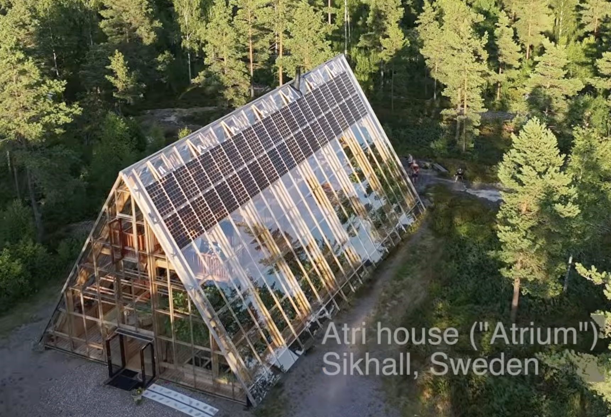

# Consider a Kasamodo version of the House-in-a-green-house Swedish Atri House in Sikhall Sweden?

## 20260907

* [Youtube: He dreamed of self-feeding solar house. So he built A-frame greenhouse home](https://youtu.be/S5KGV4NAE3A)

* [The Atri House official web site](https://naturvillan.com/atri/)
  * Oh, they seem to be a company selling their know-how (or even a whole house bild)?
  * They won the [Byggnadsvårds- och arkitekturprisets första vinnare 2024 blev Atri - glashuset i Sikhall](https://vanersborg.se/bygga-bo-och-miljo/bygga-riva-forandra/byggnadsvards--och-arkitekturpriset/pristagare-2024)

  So the monetization of the Atri House knowledge kind-of run counter to the idea of Kasamodo.

  * Should we contact Naturvillan AB to see what knowledge is available at low cost for win-win?
  * Or should we reverse engineer from information available and be inspired by the bery existence of houses inside green houses?

I thought I had made a 'Todo-mail' about this concept of a house inside a green house? But I seem to not be able to find it?

Anyhow, what could the next steps be?

* How can I design a green house with wooden frame and glass windows?
* In the video the designer mentions the waste water is cleaned by being filtered through plant beds.
  * First step seems to be a wall of vulkanic rocks (and worms?)
  * Then a series of plant beds on a slich slope for self propagation
* The designer also seems to state that they have developed a 'livencing framework' to make it easier for govertnment officials to approve builds like this.
  * Can we get hold of this information to help with building Kasamodo based on this design?

Ok, so basically - How hard can it be to try some 'safe' first design of a kasamodo inside a green house and take it from there?

* And possibly add the water filtering later?
* And possibly try the Aquaponic water filtering with fish tanks?

