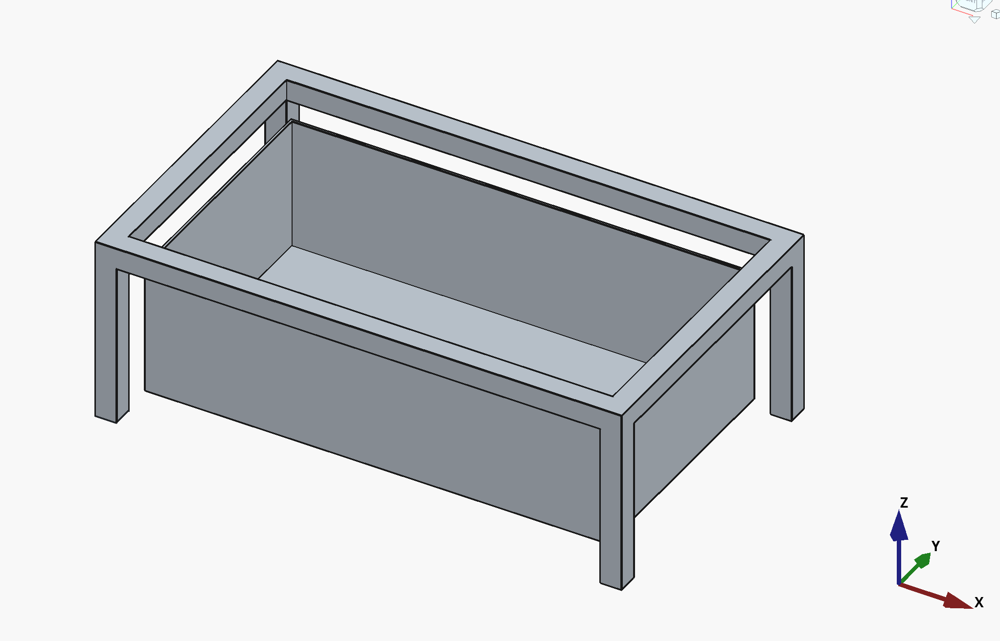

# kasamodo_0

Kasamodo 0 is an outer frame with an inner 'hanging' living apartment (box).


*kasamodo 0 outer frame and inner living apartment*

## Freecad version

This is the very first CAD model in the casamodo git repo.

The project file is 'kasamodo_0.FCStd' for FreeCad.

```sh
OS: macOS 14.6
Architecture: arm64
Version: 1.1.0dev.40419 (Git) Conda
Build type: Release
Branch: main
Hash: cf477695f9662d9892d5fc79e83065b4ac3d52bf
Python 3.11.11, Qt 5.15.15, Coin 4.0.3, Vtk 9.3.0, IfcOpenShell 0.0.0, OCC 7.8.1
Locale: C/Default (C)
Stylesheet/Theme/QtStyle: FreeCAD Light.qss/FreeCAD Light/Fusion
Logical/physical DPI: 72/127.5
```